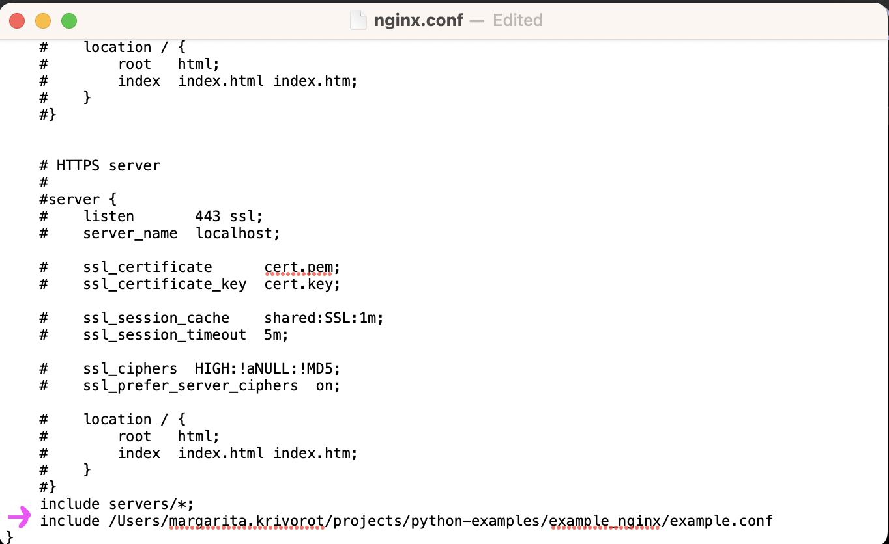

To install nginx:

```
brew install nginx
```


To start nginx

NOTE: `brew` is not showing errors, read: https://stackoverflow.com/questions/38040732/homebrew-nginx-not-running-but-says-it-is-in-brew-services (nginx is failing to launch because of an error, but brew-services is not communicating that to you)

```
sudo nginx
```
To check if nginx is running

```
# this command lies: brew services list
sudo lsof -i TCP:80
```


To include custom config




To reload 

```
sudo nginx -s stop 
sudo nginx
```
or
```
sudo nginx -s reload
```

Possible errors on start

