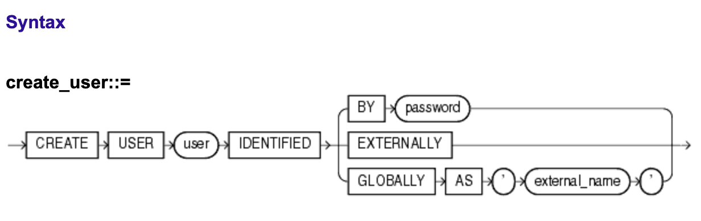
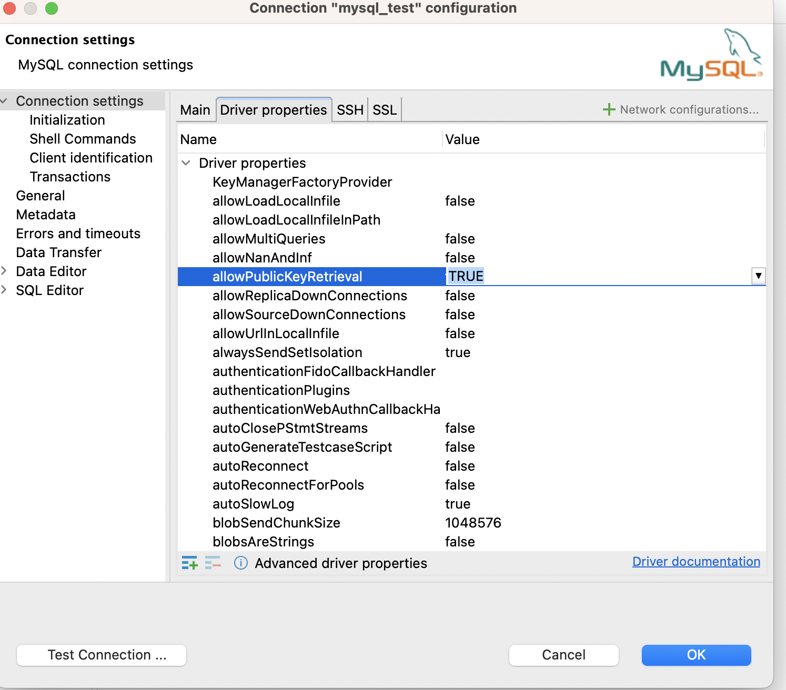

# MySQL with Python
### Docker
#### Run docker container from official image

From [Meduim](https://medium.com/@maravondra/mysql-in-docker-d7bb1e304473#id_token=eyJhbGciOiJSUzI1NiIsImtpZCI6IjQ1MjljNDA5Zjc3YTEwNmZiNjdlZTFhODVkMTY4ZmQyY2ZiN2MwYjciLCJ0eXAiOiJKV1QifQ.eyJpc3MiOiJodHRwczovL2FjY291bnRzLmdvb2dsZS5jb20iLCJhenAiOiIyMTYyOTYwMzU4MzQtazFrNnFlMDYwczJ0cDJhMmphbTRsamRjbXMwMHN0dGcuYXBwcy5nb29nbGV1c2VyY29udGVudC5jb20iLCJhdWQiOiIyMTYyOTYwMzU4MzQtazFrNnFlMDYwczJ0cDJhMmphbTRsamRjbXMwMHN0dGcuYXBwcy5nb29nbGV1c2VyY29udGVudC5jb20iLCJzdWIiOiIxMDc5OTU3MDk4NzY3NjcwMzg0MTEiLCJlbWFpbCI6Im0uaS5rcml2b3JvdEBnbWFpbC5jb20iLCJlbWFpbF92ZXJpZmllZCI6dHJ1ZSwibmJmIjoxNzIzMTg1ODIwLCJuYW1lIjoiTWFyZ290IiwicGljdHVyZSI6Imh0dHBzOi8vbGgzLmdvb2dsZXVzZXJjb250ZW50LmNvbS9hL0FDZzhvY0s4NE8tNXd6cTg4Q0dhTHpNNkpxRVNkWWQ4NFlYTFBWVjVkdHZ1QTFlOGlKeldIb0ZnPXM5Ni1jIiwiZ2l2ZW5fbmFtZSI6Ik1hcmdvdCIsImlhdCI6MTcyMzE4NjEyMCwiZXhwIjoxNzIzMTg5NzIwLCJqdGkiOiI0ZGVkZWE5ZDJhMjM3MjgzYzI1M2E3NDMwYTA1NmRhZTQyN2U0MTU0In0.qP_0dAfrOq1UUj7SnLbW8u-WepbHhaY8dunChvw76yPMEnC7hhTsnOkoXXI0br1xIWNXWWEKJPq7zxrNSbLHWclaivcKLCli8Rfdpo9WMCyHn6xEfacLxrFQwTvTvMorqeypkEf3IqNgeVaeLYLGgIv1GaGWXKz6YjmZCLk1Y0H_ZLvhhj8QP6rjSTpYYsJqpS59GMRapZ1kfqOhXN9PoOwoYl_4Kruu3jpiWPl8mgSOGV0QJHnFfEB2VTmOZNdk8U-iFw7QDE7eoan9pSm_XuJehRb_2NE3iskC29lbtZ6VUwu4astMD3kGP_KrGwtEIdKPmBncd7yLJcla68EncQ)

```
docker run --name='my_sql_container' -d -p 3306:3306 mysql/mysql-server
```

or with defined root password

```
docker run --name mysql-test -e MYSQL_ROOT_PASSWORD=<MYSQL_ROOT_PASSWORD> -d -p 3306:3306 mysql/mysql-server
```


`docker run` the command for starting the docker container from the image

`--name='my_sql_container'` after the argument, is defined the name of the container, without this argument name will be generated automatically

`-d` a very important argument, which ensures, that the container in detached mode will be running

`-p 3306:3306` mapping port from a docker container to host port. Because MySQL is running on port 3306 I mapped exactly this port outside of container.

`mysql/mysql-server` name of our images

#### Connect to running docker container
```
docker exec -it <name> bash
```

`docker exec`  - execution docker command

`-it` allow tty and keep stdin

`bash` because we want to start bash (unteresting, what else we can start)

#### Connect to mysql instance to create users, DBs, tables

Go to folder, connect to instance, select DB `mysql`, select users you have
```
cd /var/lib/mysql
mysql -u root -p <MYSQL_ROOT_PASSWORD>
SHOW DATABASES;
use mysql;
select user from user;

-- to create a user
CREATE USER 'margo'@'%' IDENTIFIED BY 'pass';
GRANT ALL PRIVILEGES ON *.* TO 'margo'@'%' WITH GRANT OPTION;
FLUSH PRIVILEGES;

-- to change password
ALTER USER 'user'@'hostname' IDENTIFIED BY 'newPass';
```



NOTE: *The statement FLUSH PRIVILEGES instructs DB to reload the in-memory copy of privileges from the privilege tables. You must execute this statement after manually editing tables such as mysql*


#### Troubleshooting DBeaver: “Public Key Retrieval is not allowed” Error
https://medium.com/@kiena/troubleshooting-dbeaver-public-key-retrieval-is-not-allowed-error-29f203d745c5




```
CREATE DATABASE <db_name>;
use <db_name>;
CREATE TABLE users (
  id SERIAL PRIMARY KEY,
  name VARCHAR(50),
  email VARCHAR(100)
);
INSERT INTO users (name, email) VALUES ('Margo', 'm@gmail.com');
SELECT * FROM users;
```

Use Control+Z to exit mysql console, but stay in bash


### Code
#### Dependencies

Do not use pipreqs here, for `mysql-connector` it corrupts requirements.txt

Read 

[Problems with mysql.connector](https://stackoverflow.com/questions/24272223/importerror-no-module-named-mysql-connector-using-python2)
```
pip install mysql-connector-python-rf
pip install mysql-connector-python
```