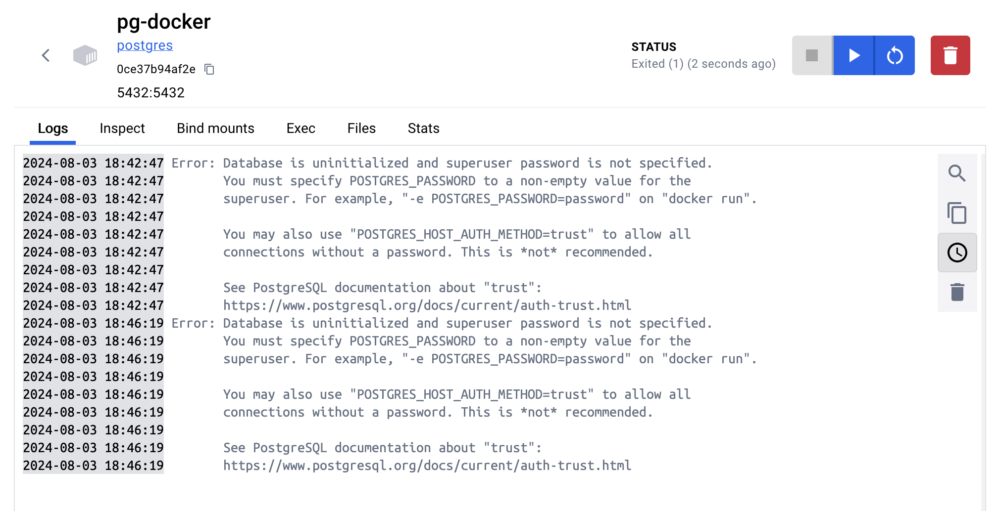
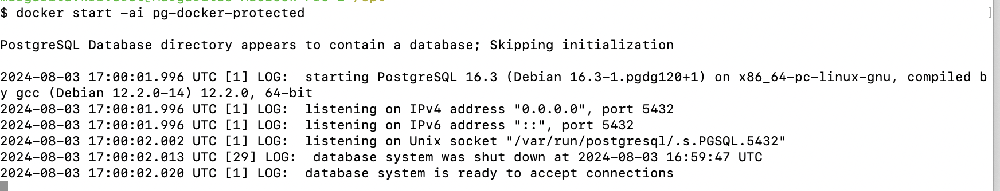
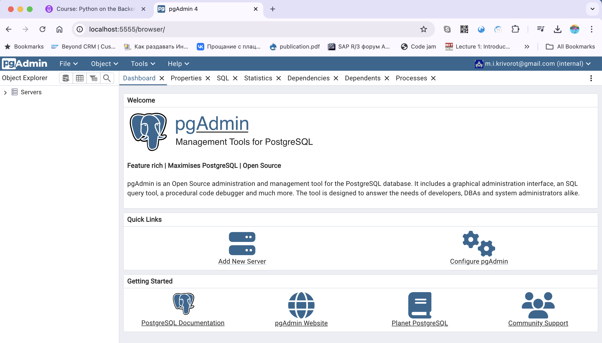
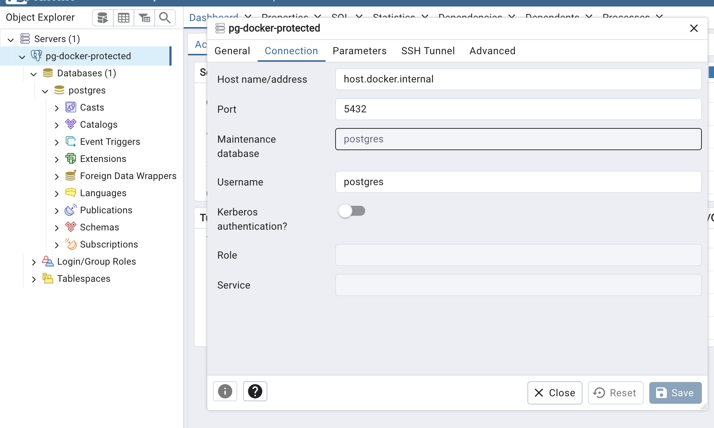

# Postgresql image
Pull docker image, start docker container for pg:

```
docker run -p 5432:5432 --name pg-docker-protected -e POSTGRES_PASSWORD=<password>  postgres
```

NOTE: `docker run -p 5432:5432 --name pg-docker postgres` <- cannot start without password

Note: Database is uninitialized and superuser password is not specified.



To start existing docker

Solution #1: Use Docker Desktop  (UI)

Solution #2: Use command line
1. Get list of all docker containers
```
docker ps -a
```

2. Find ID of your container and start it
```
docker start bb4dbb063dc4
```

or

```
docker start -ai bb4dbb063dc4
```

or by name
```
docker start pg-docker-protected
```



# pg-admin image (same as DBeaver for MySQL)

```
docker run -p 5555:80 --name pg-admin -e PGADMIN_DEFAULT_EMAIL="<email>" -e PGADMIN_DEFAULT_PASSWORD=<password> dpage/pgadmin4
```



Connect to postgresql container running on the same machine, use `host.docker.internal` as host name/address:




