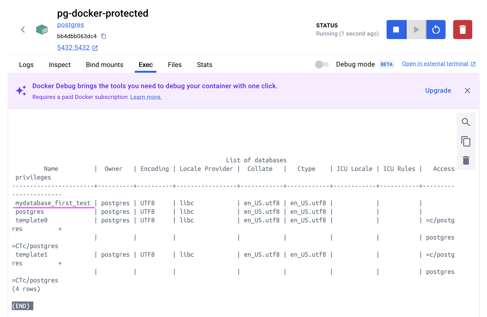
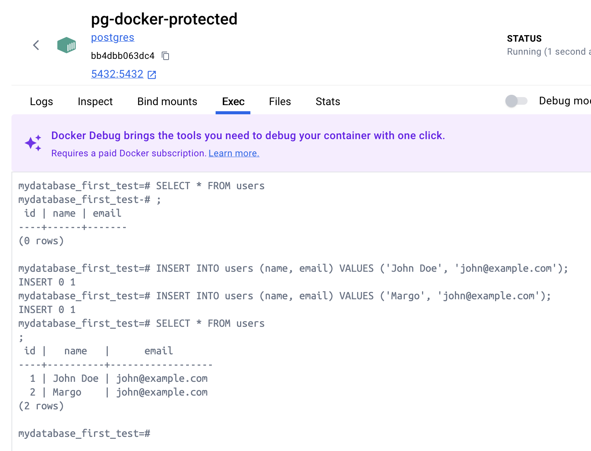
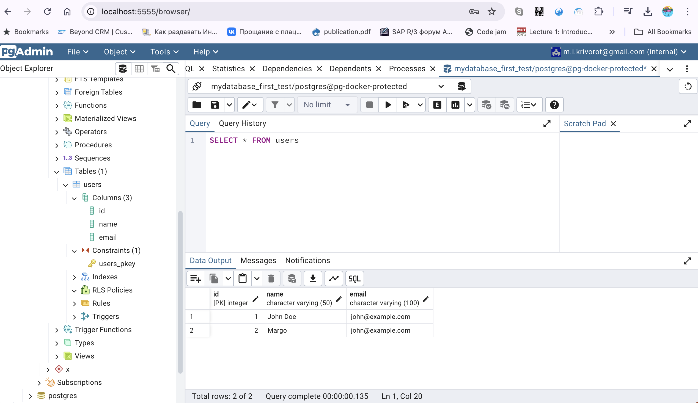
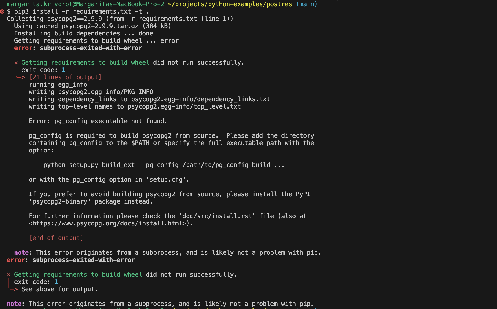

# Inside container

In Docker Desktop navigate to `exec` window (container bash) and connect to postgres
```
psql -h localhost -U postgres
```

List all DBs:

```
\l
```



```
CREATE DATABASE <db_name>;
\c <db_name>
CREATE TABLE users (
  id SERIAL PRIMARY KEY,
  name VARCHAR(50),
  email VARCHAR(100)
);

INSERT INTO users (name, email) VALUES ('John Doe', 'john@example.com');
INSERT INTO users (name, email) VALUES ('Jane Smith', 'jane@example.com');
```




```
docker exec -it test_pg bash
psql -U postgres
CREATE SCHEMA ts;
CREATE TABLE ts.test_tab (id serial primary key, val int, task text);
INSERT INTO ts.test_tab (val,task) values (1,'abc'), (2, 'def');
SELECT * FROM ts.test_tab;
\q
```

Note: to install `psycopg2`, postgresql installation is required, even if you run it in a container,see https://stackoverflow.com/questions/33866695/error-installing-psycopg2-on-macos-10-9-5



```
brew install postgresql
export PATH=/Applications/Postgres.app/Contents/Versions/@latest/bin/:$PATH
```


https://www.psycopg.org/docs/


