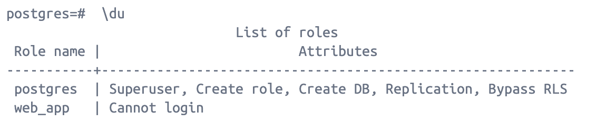
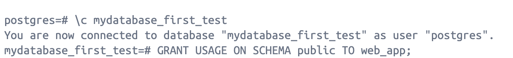
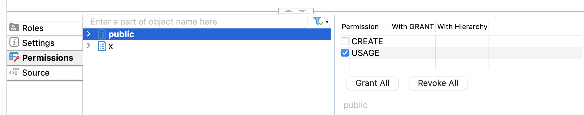
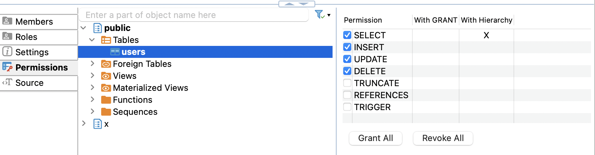

# Permissions

PostgreSQL and MySQL take different approaches to security. Both have mechanisms for granting access to schemas and tables to defined users, but PostgreSQL offers more advanced features.

PostgreSQL has a fine-grained approach to user privileges, allowing administrators to assign more specific privileges to users and roles. MySQL, on the other hand, uses a more broad and more basic authorization system with a combination of user accounts and global or database-specific privileges.

(From [this link](https://www.logicmonitor.com/blog/postgresql-vs-mysql#:~:text=PostgreSQL%20has%20a%20fine%2Dgrained,global%20or%20database%2Dspecific%20privileges.))


Goal: create user role and user only to connect from web app, without GRANT ALL permissions.

Flow is based on [this article](https://dashibase.com/blog/restricted-postgresql-user/)

Connect to postgresql instance in running Docker container

```
psql -U postgres
```

Create role
```
CREATE ROLE web_app;
```

Check that the role was successfully created
```
SELECT rolname FROM pg_roles;
```

Check permissions for the role:
```
\du
```


Grant this role permission to connect to the database `mydatabase_first_test`:

```
GRANT CONNECT ON DATABASE mydatabase_first_test TO web_app;
```

### Switch to db usage, otherwise no changes will be applied!!!:
```
\c mydatabase_first_test
```

Give the role usage access to our public schema

> Like in many other database management systems, the public schema in PostgreSQL is created by default when initializing a new database and cannot be removed. It serves as a default schema and contains system objects and functions that are accessible to all users. While you cannot remove the public schema, you can still create additional custom schemas and organize your database objects within them.

```
GRANT USAGE ON SCHEMA public TO web_app;
```



Grant full access to specific tables or to all tables in DB

```
GRANT SELECT, INSERT, UPDATE, DELETE
ON TABLE products, orders
TO web_app;

# or

GRANT SELECT, INSERT, UPDATE, DELETE
ON ALL TABLES IN SCHEMA public 
TO web_app;
```


Now create user and grant role to it:

```
CREATE USER example_app WITH PASSWORD <password>;
GRANT web_app TO example_app;
```


Other commands:


```
REVOKE ALL ON TABLE public.users FROM web_app;
```